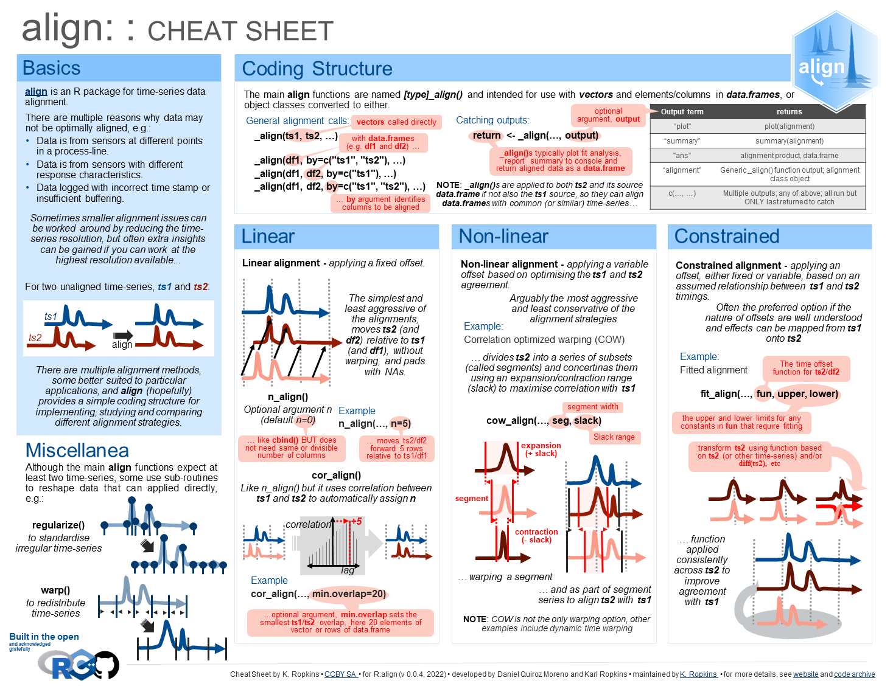

<!-- README.md is generated from README.Rmd. Please edit that file -->

# align 

<!-- badges: start -->
<!-- badges: end -->

Methods for the alignment and merging of partially or inexactly aligned
data.

## Installation

You can install the development version of align from
[GitHub](https://github.com/).

(As well as `R`, the package also includes some `c++` code. So, if you
have not used similar before you may need to install a compiler, for
example [Rtools](https://cran.r-project.org/bin/windows/Rtools/) if you
are using Windows).

``` r
install.packages("devtools") #if you don't already have it
devtools::install_github("KarlRopkins/align")
```

## Cheat Sheet

<a href="man/articles/align_cheatsheet.pdf"></a>

## Contributing

Contributions are very welcome, using tidyverse contribution guidance
and code of conduct but not as strict as them regarding coding style…
[Contributions](https://karlropkins.github.io/align/CONTRIBUTING.html)

## License

[GPL-3](https://karlropkins.github.io/align/LICENSE.html)
