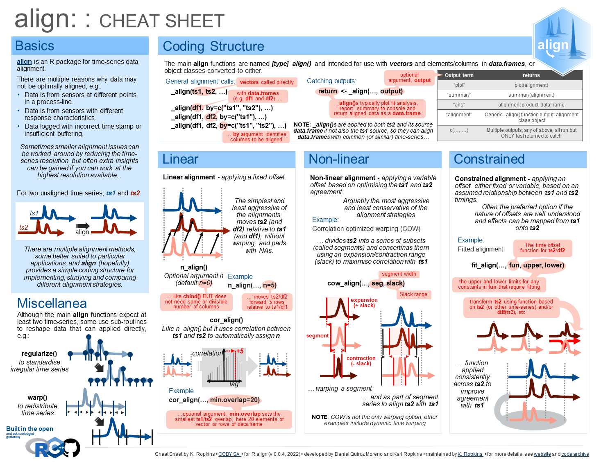

<!-- index.md is generated from index.Rmd. Please edit that file -->

```{r, include = FALSE}
knitr::opts_chunk$set(
  collapse = TRUE,
  comment = "#>",
  fig.path = "man/figures/README-",
  out.width = "100%"
)
```

# align 

<!-- badges: start -->
<!-- badges: end -->

Methods for the alignment and merging of partially or inexactly
aligned data.

## Installation

You can install the development version of **align** from [GitHub](https://github.com/). 

(As well as `R` code, the package also includes some `c++`. So, if you have not used similar before you may need to install a compiler, for example [Rtools](https://cran.r-project.org/bin/windows/Rtools/) if you are using Windows).


```{r install, eval=FALSE}
install.packages("devtools") #if you don't already have it
devtools::install_github("KarlRopkins/align")
```

## Cheat Sheet

<a href="reference/figures/align_cheatsheet.pdf"></a>  

## Contributing
**align** is an in-development package, and contributions are very welcome. We are using tidyverse contribution guidance regarding code of conduct but are not strict as them regarding coding style...  [Contributions](https://karlropkins.github.io/align/CONTRIBUTING.html)    

## License
[GPL-3](https://karlropkins.github.io/align/LICENSE.html)

